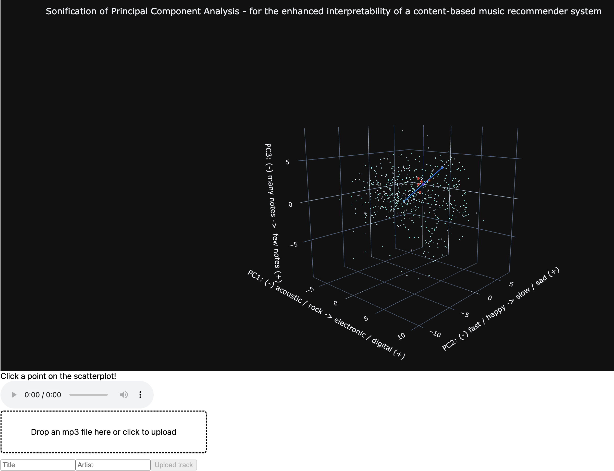
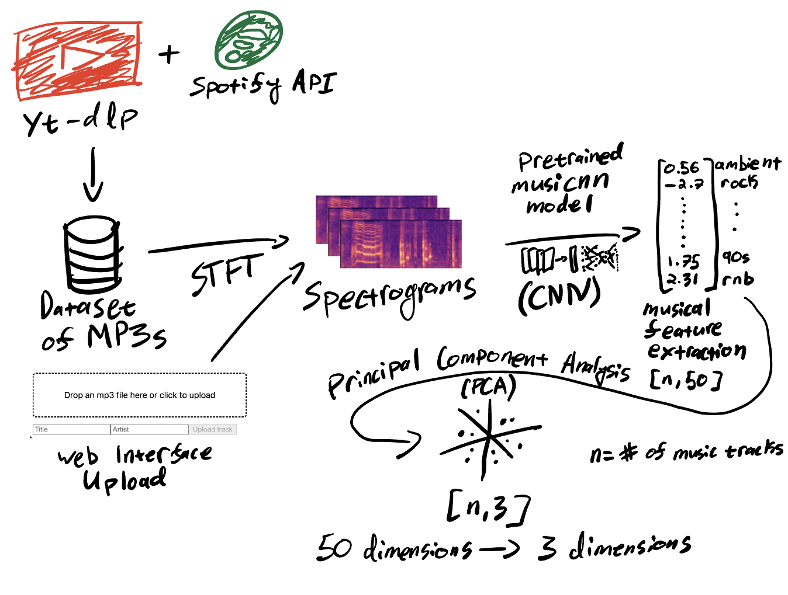

# Sonification of Principal Component Analysis

Final project for PAT 462 - Digital Sound Synthesis, Fall 2025

Dennis Farmer

- Run in terminal: `python ./web_interface.py` (after setup)
- Then, visit `http://127.0.0.1:8050/` in your web browser.



## Setup
```sh
# python --version: 3.12.12
python -m venv .env
source .env/bin/activate
pip install -r requirements.txt
```

## Run Web Interface

```sh
source .env/bin/activate
python ./web_interface.py
```

## Explaination of Sonification



The core idea behind this project is that when dimensionality reduction is performed using Principal Component Analysis, each of the principal components has some correlation with the original features. As you move along one of the dimensions in the reduced space, that movement corresponds to some linear combination of the original features. This can then be mapped to some sound that represents the change in the original features, creating a unique sonification for each song in a massive dataset of songs. The sonification provides an intuition for what each of the principal components actually represents in the original data.

In this case, the "original data" is in the form of of a collection of musical features extracted from a large mp3 dataset using a pretrained feature extractor (musicnn). This model computes spectrograms from the audio files, and feeds them through a convolutional neural network, resulting in a vector with 50 dimensions, each representing some music audio tag, such as "guitar", "classical", "slow", "techno", and so on. We treat this as an embedding in a 50 dimensional space, where similar songs are close in proximity to each other in this space. We can then make content-based music recommendations using this; if you listen to a playlist of tracks that forms a cluster in this space, we can recommend to you tracks that are nearby the centroid of your playlist, based on converting each track to a vector using our musicnn feature extractor.

However, it is difficult to visualize 50 dimensions. What if we could instead (attempt to) perform sonification of 50 dimensions?

The principal components (three in this case) are constructed such that they capture the most amount of variation in the original features (50 in this case). The principal components are the eigenvectors of the covariance matrix of the data, and they point in the directions of maximum variance in the data, ordered by descending order of amount of variance explained (PC1, PC2, PC3).

A concept called the "correlation loadings" matrix captures the interpretation of how the principal components relate to the original data, in the form of correlations between the original variables and each of the three principal components. This can be computed in Python to retrieve how each PC correlates with each of the 50 feature tags that MusiCNN gives us.

This gives us a way to map a coordinate in PC space to its relative connection to the original features, by multiplying the PC coordinate by our correlation loadings matrix (along with some scaling and normalizing, see `dimensionality_reduction.py:compute_pc_mapping()` code below). This way, we recover an approximation of the original 50 features from a PC point. Note: since we have reduced the dimensionality (50->3) and then reconverted back to the original feature space using the correlations (3->50), we have lost a slight bit of information / accuracy, but this maintains the purpose of sonifying the principal components, not sonifying the large-dimensional data directly.

Now that we have a way to relate the PCs to the original features. From here, we can perform an eyeball check to each of the sorted columns of the correlation loadings matrix. 

- Principal Component 1:
       - positively correlated with various rock and metal tags
       - negatively correlated with rnb and electronic tags
- Principal Component 2:
       - positively correlated with sad, ambient, and mellow tags
       - negatively correlated with party and catchy, tags
- Principal Component 3:
       - positively correlated with experimental and indie tags
       - negatively correlated with soul, country, and easy listening tags

We can then normalize each tag to be between 0.0 and 1.0, and take weighted averages of tag values (upscaled from PC coordinates) to define sonification parameter mappings.

- Principal Component 1:
       - positive: high filter cutoff, more gain on random notes to sound digital
       - negative: low filter cutoff to sound more like popular / rock music, minimal random notes
- Principal Component 2:
       - positive: slow tempo, sad modes like Locrian, Phrygian, Aeolian, ...
       - negative: fast tempo, happy modes like Lydian, Ionian, Mixolydian, ...
- Principal Component 3:
       - positive: many notes, using most or all of the scale degrees chosen by PC2
       - positive: fewer notes to sound simpler, less experimental


See `sonification.ck` for implementation of selecting which feature tags are used for which parameters; it is mostly a trial-based process of seeing which parameters are useful to map to specific tags that correlate with specific principal components to craft an interpretable story, but I think I landed on a parameter mapping that makes a bit of sense.

Note that not all 50 original features are used in the sonification, and in most cases an average of tag values are used to perform a parameter mapping. Since all the complicated math utilized in this project strongly places this sonification in the "model-based" category, it is less likely that we will have a solid grounded motivation to be precise about which tags match to which parameters, since for instance it is hard to tell the exact difference be4tween "electronic", "electronica", and "electro". In addition, enumerating over all 50 original features and finding a specific parameter to map them to would result in an overly complex sonification result, which would muddy the interpretability of it and result in a random noise generator.

Selecting the feature tags based on their correlations with the principal components allows the crafting of a story based on statistical rigor, while also allowing room for some creativity and musification of the interpretation of the data.


```py
# dimensionality_reduction.py
# from dimensionality_reduction import *
metadata_df, feature_df, X = load_dataset()
pca, scaler, X_reduced = fit_pca(X, n_components=3)

# eigenvalues of the covariance matrix: shape [3,]
# array containing the variance explained by each
# principal component (descending order of importance)
eigenvalues = pca.explained_variance_

# eigenvectors of the covariance matrix: shape [3, 50]
# the principal components: represent the directions
# of maximum variance in the data, with corresponding
# eigenvalues indicating the amount of variance
# explained by each component (ordered from highest to lowest variance)
eigenvectors = pca.components_

# correlation loadings: shape [50, 3]
# the correlations between original (standardized) variables 
# and each of the three principal components
# used to interpret the principal components
corr_loadings = eigenvectors.T * np.sqrt(eigenvalues)

# parameter mapping: shape [n, 50]
# transform each coordinate in PC space to a value in the range [0, 1]
# representing how much of each of the 50 tags to incorperate in the
# sonification
param_mapped = X_reduced.dot(corr_loadings_matrix.T)
param_map_scaler = MinMaxScaler((0, 1))
param_map_scaler.fit(param_mapped)

# ==============================
# to convert [pc1, pc2, pc3] to approximation of original 50 features:
# ==============================
def pc_mapping(pc1, pc2, pc3): 
       return param_map_scaler.transform(
              np.array([pc1, pc2, pc3]).reshape(1,3).dot(corr_loadings_matrix.T)
              )[0]


scaled_param_mapped = param_map_scaler.transform(param_mapped)
scaled_map_df = pd.DataFrame(scaled_param_mapped, columns=embedding_tags)
print(scaled_map_df.head())
```
```
       rock       pop  alternative     indie  electronic  female vocalists     dance       00s  ...
0  0.663481  0.643016     0.555258  0.511884    0.238240          0.746857  0.197852  0.170410  ...
1  0.479122  0.556255     0.480509  0.468945    0.448559          0.584564  0.491942  0.424967  ...
2  0.774539  0.476863     0.601628  0.483133    0.150899          0.471548  0.153705  0.129562  ...
3  0.200346  0.551253     0.394956  0.480427    0.770540          0.591849  0.847467  0.762718  ...
4  0.146716  0.551616     0.305136  0.366508    0.762953          0.499064  0.947074  0.780741  ...

[5 rows x 50 columns]
```
```py

corr_loadings_df = pd.DataFrame(corr_loadings, columns=["PC1", "PC2", "PC3"], index=embedding_tags)
print(corr_loadings_df["PC1"].sort_values())
print(corr_loadings_df["PC2"].sort_values())
print(corr_loadings_df["PC3"].sort_values())
print(corr_loadings_df)
```

# Principal Component 1:

```
sexy               -0.843331
rnb                -0.821042
hip-hop            -0.795363
dance              -0.710728
house              -0.648790
electro            -0.605079
party              -0.595210
chillout           -0.584335
electronica        -0.579140
electronic         -0.577343
chill              -0.558650
soul               -0.532486
00s                -0.475404
funk               -0.438323
pop                -0.229047
ambient            -0.220555
female vocalist    -0.186253
female vocalists   -0.153388
male vocalists     -0.137807
jazz               -0.091945
mellow             -0.011453
easy listening     -0.006470
experimental        0.080944
catchy              0.094613
beautiful           0.216365
instrumental        0.223810
90s                 0.227794
sad                 0.283992
acoustic            0.294458
happy               0.306620
indie pop           0.342492
indie               0.403585
country             0.503970
oldies              0.525818
80s                 0.548235
indie rock          0.548306
folk                0.557729
alternative         0.609929
60s                 0.650924
blues               0.659845
70s                 0.716021
metal               0.736966
alternative rock    0.753399
punk                0.772961
heavy metal         0.849017
guitar              0.858537
hard rock           0.876921
progressive rock    0.891275
rock                0.909364
classic rock        0.913002
```

# Principal Component 2:

```
party              -0.425044
catchy             -0.409079
90s                -0.329197
hard rock          -0.308418
punk               -0.268789
80s                -0.247126
heavy metal        -0.217332
funk               -0.210925
metal              -0.124359
rock               -0.120242
classic rock       -0.111377
hip-hop            -0.091466
dance              -0.046069
70s                -0.017500
rnb                 0.009198
alternative rock    0.018572
sexy                0.069646
pop                 0.074263
happy               0.083826
male vocalists      0.093098
soul                0.130521
electro             0.187687
00s                 0.200246
blues               0.210981
60s                 0.216609
oldies              0.225410
house               0.227506
progressive rock    0.231016
indie rock          0.232631
alternative         0.237339
country             0.300640
female vocalist     0.309438
guitar              0.314750
female vocalists    0.327215
electronic          0.383352
electronica         0.428972
indie               0.446699
instrumental        0.501191
experimental        0.516967
indie pop           0.557812
chill               0.675331
jazz                0.691206
folk                0.720312
chillout            0.749058
ambient             0.766728
acoustic            0.780743
easy listening      0.782069
sad                 0.865602
beautiful           0.914704
mellow              0.928097
```

# Principal Component 3

```
soul               -0.707653
country            -0.591799
oldies             -0.576096
easy listening     -0.563494
blues              -0.470753
jazz               -0.465426
60s                -0.458093
pop                -0.440715
70s                -0.428760
male vocalists     -0.426289
female vocalist    -0.413621
rnb                -0.380297
female vocalists   -0.352795
90s                -0.286265
folk               -0.267119
funk               -0.250946
guitar             -0.225708
acoustic           -0.207770
80s                -0.192070
mellow             -0.178481
classic rock       -0.178135
sexy               -0.098933
sad                -0.097291
catchy              0.005483
happy               0.030100
dance               0.059059
beautiful           0.076284
chill               0.078390
progressive rock    0.106797
rock                0.142034
hip-hop             0.152457
chillout            0.152609
hard rock           0.165353
house               0.187132
heavy metal         0.221127
party               0.237724
instrumental        0.295734
ambient             0.342433
punk                0.447225
indie pop           0.458967
metal               0.459717
alternative rock    0.472245
electronica         0.502482
00s                 0.505069
electronic          0.539842
electro             0.558103
alternative         0.585223
indie               0.625552
indie rock          0.657105
experimental        0.720343
```

# All Principal Components

```
                       PC1       PC2       PC3
rock              0.909364 -0.120242  0.142034
pop              -0.229047  0.074263 -0.440715
alternative       0.609929  0.237339  0.585223
indie             0.403585  0.446699  0.625552
electronic       -0.577343  0.383352  0.539842
female vocalists -0.153388  0.327215 -0.352795
dance            -0.710728 -0.046069  0.059059
00s              -0.475404  0.200246  0.505069
alternative rock  0.753399  0.018572  0.472245
jazz             -0.091945  0.691206 -0.465426
beautiful         0.216365  0.914704  0.076284
metal             0.736966 -0.124359  0.459717
chillout         -0.584335  0.749058  0.152609
male vocalists   -0.137807  0.093098 -0.426289
classic rock      0.913002 -0.111377 -0.178135
soul             -0.532486  0.130521 -0.707653
indie rock        0.548306  0.232631  0.657105
mellow           -0.011453  0.928097 -0.178481
electronica      -0.579140  0.428972  0.502482
80s               0.548235 -0.247126 -0.192070
folk              0.557729  0.720312 -0.267119
90s               0.227794 -0.329197 -0.286265
chill            -0.558650  0.675331  0.078390
instrumental      0.223810  0.501191  0.295734
punk              0.772961 -0.268789  0.447225
oldies            0.525818  0.225410 -0.576096
blues             0.659845  0.210981 -0.470753
hard rock         0.876921 -0.308418  0.165353
ambient          -0.220555  0.766728  0.342433
acoustic          0.294458  0.780743 -0.207770
experimental      0.080944  0.516967  0.720343
female vocalist  -0.186253  0.309438 -0.413621
guitar            0.858537  0.314750 -0.225708
hip-hop          -0.795363 -0.091466  0.152457
70s               0.716021 -0.017500 -0.428760
party            -0.595210 -0.425044  0.237724
country           0.503970  0.300640 -0.591799
easy listening   -0.006470  0.782069 -0.563494
sexy             -0.843331  0.069646 -0.098933
catchy            0.094613 -0.409079  0.005483
funk             -0.438323 -0.210925 -0.250946
electro          -0.605079  0.187687  0.558103
heavy metal       0.849017 -0.217332  0.221127
progressive rock  0.891275  0.231016  0.106797
60s               0.650924  0.216609 -0.458093
rnb              -0.821042  0.009198 -0.380297
indie pop         0.342492  0.557812  0.458967
sad               0.283992  0.865602 -0.097291
house            -0.648790  0.227506  0.187132
happy             0.306620  0.083826  0.030100
```
